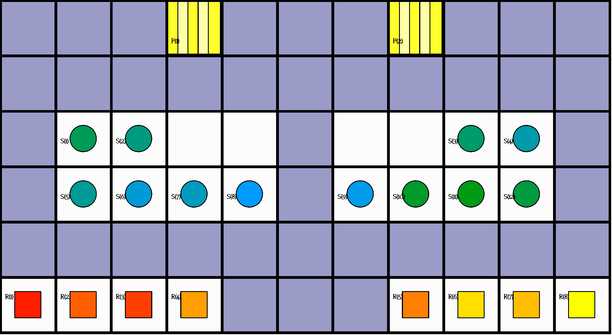

# *asprilo* Seminar Exercises

## About

This is a collection of seminar exercises for  [**asprilo**](<https://potassco.org/asprilo>).

## Preliminaries

 Before addressing the exercises, we strongly recommend you to study

- the asprilo [paper](https://arxiv.org/abs/1804.10247)
- the asprilo [website](<https://potassco.org/asprilo>)
- the [development branch](https://github.com/potassco/asprilo-encodings/tree/develop) of our repository on asprilo encodings, esp. the [user  guide](https://github.com/potassco/asprilo-encodings/blob/develop/README.md)

**Important:** the subsequent exercises will use the encodings provided by the [development branch of asprilo-encodings](https://github.com/potassco/asprilo-encodings/tree/develop) as foundation.


## Exercise 1: Single Robot, M-Domain

Consider the following objectives for **structured instances with a single robot in the M-domain** e.g. instance [`instances/x11_y6_n66_r1_s8_ps1_pr8_u8_o8_N001.lp`](instances/x11_y6_n66_r1_s8_ps1_pr8_u8_o8_N001.lp)


1.  *Relax the goal condition such that all shelves with ordered products can be
    visited at an arbitrary time point*

    -   Apply your modifications to the direct encoding, specifically the [goal
        condition](https://github.com/potassco/asprilo-encodings/blob/develop/m/goal-M.lp): edit the
        goal condition such that all shelves that contain an ordered product can be visited at an
        arbitrary point in time (instead of the last time step).
    -   Run your modified encoding on instance [`instances/x11_y6_n66_r1_s8_ps1_pr8_u8_o8_N001.lp`](instances/x11_y6_n66_r1_s8_ps1_pr8_u8_o8_N001.lp)

        via

        ```shell
        clingo -c horizon=16 \
        $ENCODINGS/m/{action-M.lp,goal-M-modified.lp} \
        instances/x11_y6_n66_r1_s8_ps1_pr8_u8_o8_N001.lp
        ```

        where

        - `$ENCODINGS` is an environment variable that holds the path to your downloaded (or cloned)
          [development branch of asprilo-encodings](https://github.com/potassco/asprilo-encodings/tree/develop)
        - `$ENCODINGS/m/goal-m-modified.lp` is your modified `$ENCODINGS/m/goal-m.lp` goal condition encoding

2.  *In addition to the previous modification, extend movement actions to also allow diagonal movement*

    -   Apply your modifications to the direct encoding, specifically the [action
        theory](https://github.com/potassco/asprilo-encodings/blob/develop/m/action-M.lp): edit the
        goal condition such that all shelves that contain an ordered product can be visited at an
        arbitrary point in time (instead of the last time step).
    -   Run your modified encoding on instance [`instances/x11_y6_n66_r1_s8_ps1_pr8_u8_o8_N001.lp`](instances/x11_y6_n66_r1_s8_ps1_pr8_u8_o8_N001.lp)

        via

        ```shell
        clingo -c horizon=10 \
        $ENCODINGS/m/{action-M-modified.lp,goal-M-modified.lp} \
        instances/x11_y6_n66_r1_s8_ps1_pr8_u8_o8_N001.lp
        ```

        where

        - `$ENCODINGS` is an environment variable that holds the path to your downloaded (or cloned)
          [development branch of asprilo-encodings](https://github.com/potassco/asprilo-encodings/tree/develop)
        - `$ENCODINGS/m/action-m-modified.lp` is your modified `$ENCODINGS/m/action-m.lp` action theory encoding
        - `$ENCODINGS/m/goal-m-modified.lp` is your modified `$ENCODINGS/m/goal-m.lp` goal condition encoding from the previous exercise


## Exercise 2: Multiple Robots, M-Domain

Consider the following objectives for **structured instances with multiple robot in the M-domain** e.g. instance [`instances/x11_y6_n66_r8_s8_ps1_pr8_u8_o8_N001.lp`](instances/x11_y6_n66_r8_s8_ps1_pr8_u8_o8_N001.lp)


1.  *Extend movement actions to also allow diagonal movement and update the collision prevention correspondingly*

    -   Apply your modifications to the direct encoding, specifically the [action
        theory](https://github.com/potassco/asprilo-encodings/blob/develop/m/action-M.lp): prevent
        edge collisions also for diagonal movements
    -   In comparison to Exercise 1.2, we
        - also take **collision prevention** into account
        - but use the **regular goal condition of the M-domain**
    -   Run your modified encoding on instance [`instances/x11_y6_n66_r8_s8_ps1_pr8_u8_o8_N001.lp`](instances/x11_y6_n66_r8_s8_ps1_pr8_u8_o8_N001.lp)

        via

        ```shell
        clingo -c horizon=20 \
        $ENCODINGS/m/{action-M-modified.lp,goal-M.lp} \
        instances/x11_y6_n66_r1_s8_ps1_pr8_u8_o8_N001.lp
        ```

        where

        - `$ENCODINGS` is an environment variable that holds the path to your downloaded (or cloned)
          [development branch of asprilo-encodings](https://github.com/potassco/asprilo-encodings/tree/develop)
        - `$ENCODINGS/m/action-m-modified.lp` is your modified `$ENCODINGS/m/action-m.lp` action theory encoding

## Exercise 3: Multiple Robots, A-Domain

Consider the following objectives for **structured instances with multiple robot in the A-domain** e.g. instance [`instances/x11_y6_n66_r8_s12_ps2_pr12_u12_o12_N001.lp`](instances/x11_y6_n66_r8_s12_ps2_pr12_u12_o12_N001.lp)



1.  *For the A-Domain, assign robots exclusively to the left and right half of the warehouse grid*

    -   Apply your modifications to the direct encoding, specifically the [assignment
        constraints](https://github.com/potassco/asprilo-encodings/blob/develop/control/assign-a.lp):
        -   let *mx* be the floor of (*sx* + 1) / 2 where *sx* is the warehouse grid's x-dimension
        -   edit the assignment constraints such that all actions of robots with an initial X-position
            - smaller or equal than *mx* are restricted to grid position with x-coordinates <= *mx*
            - otherwise, are restricted to grid position with x-coordinates > *mx*
        -   intuitively, robots that are initially placed in the "left half" or "right half" of the
            warehouse should stay in "left half" or "right half", resp., throughout the whole plan execution.
    -   Run your modified encoding on instance [`instances/x11_y6_n66_r8_s12_ps2_pr12_u12_o12_N001.lp`](instances/x11_y6_n66_r8_s12_ps2_pr12_u12_o12_N001.lp)

        via

        ```shell
        clingo --out-atomf='%s.' -V0 -q1,2,2 \
        $ENCODINGS/control/assign-a-modified.lp \
        instances/x11_y6_n66_r8_s12_ps2_pr12_u12_o12_N001.lp | \
        head -n 1 | \
        clingo -c horizon=20 - \
        $ENCODINGS/control/control-abc.lp \
        $ENCODINGS/abc/{action-MPPD-a.lp,goal-a.lp} \
        instances/x11_y6_n66_r8_s12_ps2_pr12_u12_o12_N001.lp
        ```

        where

        - `$ENCODINGS` is an environment variable that holds the path to your downloaded (or cloned)
          [development branch of asprilo-encodings](https://github.com/potassco/asprilo-encodings/tree/develop)
        - `$ENCODINGS/control/assign-a-modified.lp` is your modified `$ENCODINGS/control/assign-a.lp` assignment encoding


## Directory Structure

- `./instances/` contains the example instances


